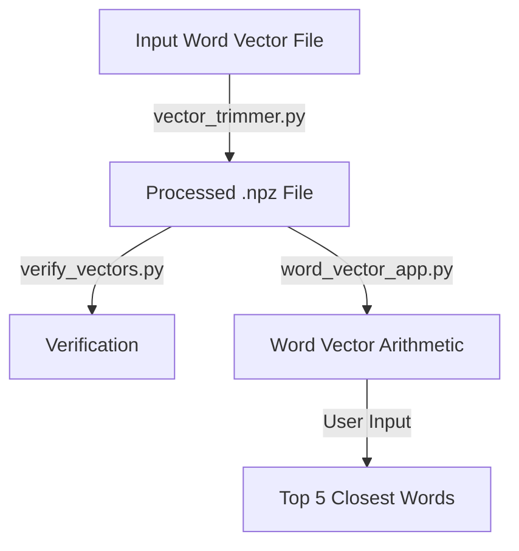

# Vector Visualizer

## 1. Code Explanation

### `vector_trimmer.py`
This script processes a word vector file (e.g., GloVe) and trims it to the first 5000 words (or processes the entire file in `--full` mode). It normalizes each vector and saves the results in `.npz` format.

- **Input**: Word vector file (e.g., `glove.6B.50d.txt`)
- **Output**: `trimmed.npz` or `glove_full.npz`
- **Key Functions**:
  - Reads and normalizes vectors.
  - Supports trimming or full processing.

### `verify_vectors.py`
This script verifies the saved vectors by:
- Printing the shape of the vector matrix.
- Checking the norm of a random vector.
- Ensuring common words like `king`, `queen` exist.
- Finding the closest word to a random vector.

### `word_vector_app.py`
This is the main application for word vector arithmetic. It allows users to input expressions like `king - man + woman` and find the top 5 closest words to the resultant vector.

- **Key Features**:
  - Parses arithmetic expressions.
  - Evaluates resultant vectors.
  - Reranks results based on similarity and role preservation.

## 2. System Architecture



## 3. High-Level Explanation

1. **Data Preparation**:
   - Use `vector_trimmer.py` to preprocess and normalize word vectors.
2. **Verification**:
   - Use `verify_vectors.py` to ensure the integrity of the processed vectors.
3. **Application**:
   - Use `word_vector_app.py` to perform word vector arithmetic and explore relationships between words.

## 4. Directory Explanation

```plaintext
VectorVisualiser/
├── .venv/               # Virtual environment
├── glove.6B.50d.txt     # Example input file
├── glove_full.npz       # Full processed vectors
├── trimmed.npz          # Trimmed vectors (5000 words)
├── vector_trimmer.py    # Script for preprocessing vectors
├── verify_vectors.py    # Script for verifying vectors
├── word_vector_app.py   # Main application for vector arithmetic
```

## 5. Example Usage

### Trimming Word Vectors
```bash
python vector_trimmer.py glove.6B.50d.txt
```

### Verifying Word Vectors
```bash
python verify_vectors.py
```

### Word Vector Arithmetic
```bash
python word_vector_app.py
```
Example Input:
```
king - man + woman
```
Example Output:
```
Top 5 closest words:
queen           | score=0.8765 | cos=0.8123 | role=0.7543
... (other results)
```